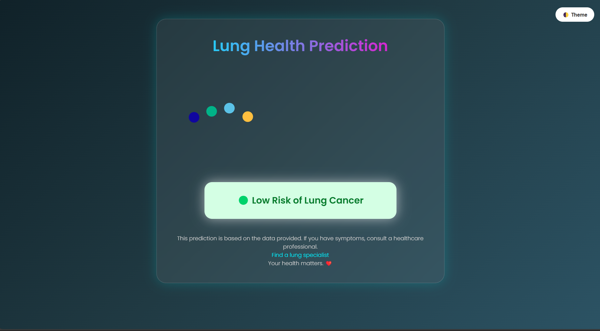

# 🫁 Lung Cancer Risk Prediction Web App

A **deep learning-powered web application** that predicts **lung cancer risk levels** — **Low**, **Medium**, or **High** — using 23 clinical, lifestyle, and environmental factors.

---

## 🔍 Overview

This project integrates a trained **MLP (Multilayer Perceptron)** deep learning model built with **TensorFlow/Keras** into a visually stunning **Flask web application**.  
Users input relevant health and lifestyle data, and the app instantly provides a lung cancer risk prediction.

---

## 🎯 Features

### 🌟 High-end UI
- ✨ Glassmorphism design
- 🌙 Dark/Light mode toggle
- 📽️ Scroll-based Lottie animations
- 📱 Fully responsive layout

### 🧠 Deep Learning
- Multilayer Perceptron (MLP) model
- StandardScaler preprocessing

### ⚙️ Real-time Prediction
- Powered by Flask backend
- Instant feedback on results page

### 📊 Training Visualization
- Model accuracy and loss graphs

### 🧪 Testing Mode
- Predefined dummy input script

### 💾 Model Artifacts
- Saved model: `my_model.h5`
- Saved scaler: `scaler.pkl`

---

## 🚀 How It Works

1. 📝 **User Inputs**  
   Age, Gender, Smoking history, Air pollution exposure, Genetic risk, etc.

2. ⚙️ **Preprocessing**  
   Inputs are scaled using `StandardScaler`.

3. 🧠 **Prediction**  
   The MLP model processes the input and predicts:
   - `Low`, `Medium`, or `High` cancer risk.

4. 🎨 **Output**  
   Prediction displayed on a beautifully designed result screen with animations.



---

## 🎨 Tech Stack

| Layer     | Tools Used                              |
|-----------|------------------------------------------|
| **Backend**  | Flask, Python                          |
| **Model**    | TensorFlow, Keras (MLP)                |
| **Frontend** | HTML5, CSS3, JavaScript                |
| **Styling**  | Bootstrap 5, Glassmorphism, Custom CSS |
| **Animations** | Lottie, AOS (Animate on Scroll), Particles.js |

---


---

## ⚙️ Installation & Running Locally

```bash
# 1. Clone the repository
git clone https://github.com/bindu2607/lung-cancer-prediction-using-deep-learning
cd lung-cancer-prediction-using-deep-learning

# 2. (Optional) Create a virtual environment
python -m venv venv
source venv/bin/activate  # Windows: venv\Scripts\activate

# 3. Install dependencies
pip install -r requirements.txt

# 4. Start the Flask web application
python app.py

# 5. (Optional) Re-train the deep learning model
python train.py

# 6. (Optional) Run prediction tests using dummy inputs
python test.py

